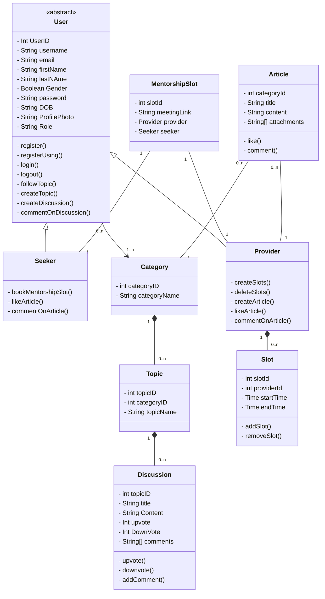

## ExpertEase

ExpertEase is a web app driving progress towards UN SDG 4: Quality Education by connecting students with professionals for mentorship, sharing resources, and fostering discussions on academic and career development, aiming to solve global educational challenges.

## Object Model using Domain Driven Design (DDM)

## Team Members

Aditya Ranjan Singh - singh.adityara@northeastern.edu

Amit Anveri - anveri.a@northeastern.edu

Anirudh Jagadish - jagadish.ani@northeastern.edu

Satish Mallikarjun Paraddi - paraddi.s@northeastern.edu

## Project Run Steps
- [Install Tailwind](https://tailwindcss.com/docs/guides/vite)
- Create .env file in server with 3 keys
  - PORT = (Server port)
  - JWT_SECRET = 12321421429104
  - MONGO_CONNECTION = mongodb+srv://<Username>:<Password>@firstcluster.ac5gcif.mongodb.net/Expertease?retryWrites=true&w=majority&appName=FirstCluster (Use the username and password for the Expertease dB access is shared)
- Run npm install in client directory
- npm run dev on client (Client server will be  up)
- Run npm install in server directory
- node server.js (Backend Server will be up)
